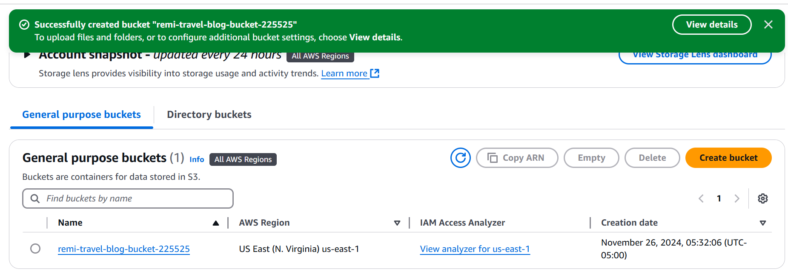
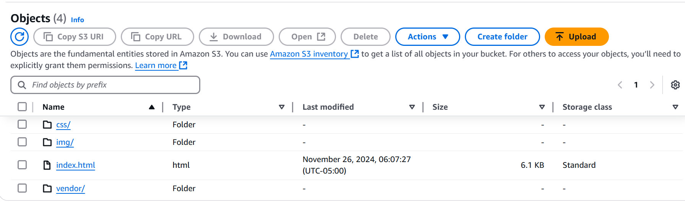
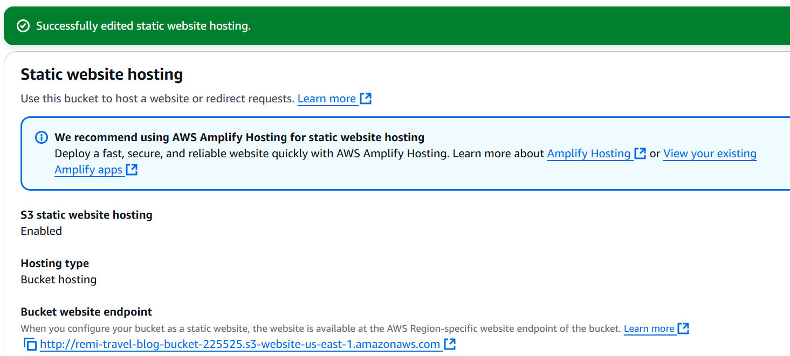
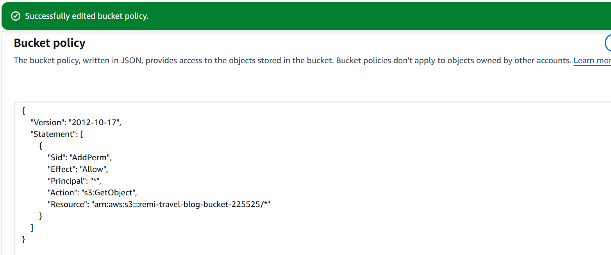
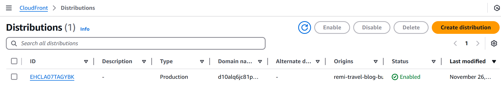
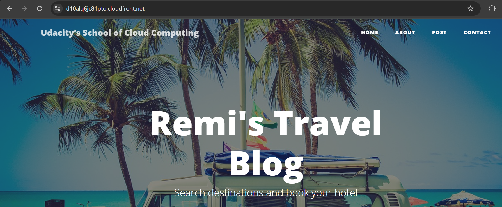
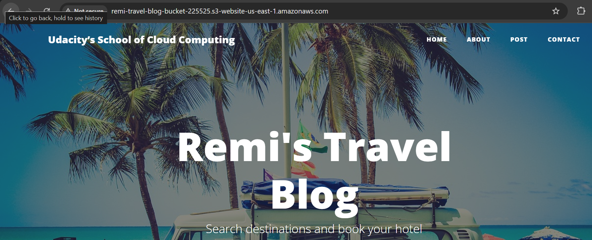

# Hosting a Static Website on AWS S3 with CloudFront as a CDN

- step 1: create an s3 bucket 

- step 2: upload files and folder to the bucket

- step 3: configure the bucket to allow static web hosting 

- step 4: create IAM bucket policy that makes the bucket contents publicly accessible.

- step 5: go to cloudfront, create a distribution and configure the settings;
- add origin domain
- enter index.html into default root object
- create distribution

- step 6: copy the domain URL and check it on the browser to confirm access to your website

- step 7: accessing via website-endpoint URL

CloudFront domain name URL: https://d10alq6jc81pto.cloudfront.net/

website-endpoint URL: http://remi-travel-blog-bucket-225525.s3-website-us-east-1.amazonaws.com/